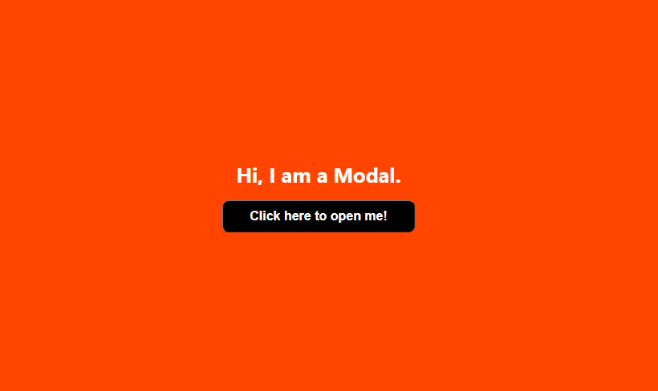

# About 
## This is a simple modal built with ReactJS and pure CSS.



# Want to see it running on your machine? 

```bash
1º Clone this repo or download it and use the command "npm install" to install the dependencies.
2º Use "npm start" to run the project. 
```

# Author
### Jean Pereira da Cruz - <a href="https://www.linkedin.com/in/jean-pereira-cruz/">Linkedin</a>
